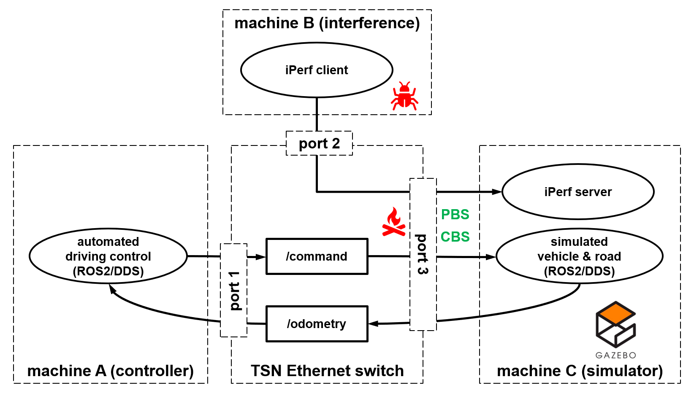

# ROS2-DDS-TSN integration demo
This repository demonstrates basic advantages of integrating the [Data Distribution Service (DDS)](https://en.wikipedia.org/wiki/Data_Distribution_Service) and [Time-Sensitive Networking (TSN) Ethernet](https://en.wikipedia.org/wiki/Time-Sensitive_Networking). The demo is based on the [Gazebo plugin `gazebo_ros_diff_drive`](http://gazebosim.org/tutorials?tut=ros2_installing&cat=connect_ros#TestingGazeboandROS2integration), modeling a differential drive vehicle in the [Robot Operating System (ROS) 2](https://www.ros.org/) environment, as well as on the GNU/Linux [VLAN](https://tsn.readthedocs.io/vlan.html) and [traffic control](https://tldp.org/HOWTO/Traffic-Control-HOWTO/intro.html) framework.

The demo video below shows the challenging [moose test](https://en.wikipedia.org/wiki/Moose_test) in the Gazebo simulator, where the white ego vehicle performs a time-critical evasive maneuver. Three different scenarios are shown:
1. successful driving without intereference,
1. collisions due to network interference without TSN features,
1. TSN features enable a successful drive with network interference.

https://user-images.githubusercontent.com/88086083/139062806-3f7f83be-af60-42f8-84c4-7a3ec174e97b.mp4

As illustrated below, this demo uses three machines connected to a TSN Ethernet switch, imitating a robot sharing Ethernet links for streams with different criticality levels. `Machine C` runs the Gazebo simulation. The control of the modeled vehicle runs on an embedded controller `machine A` and publishes the safety-critical topic `/command` based on the data from the `/odometry` topic. An interference `machine B` floods the egress of `port 3` and interfere with the control traffic in the `/command` topic. This interference is likely to trigger a collision in the simulation. Interference may originate from a bug in `machine B`, see the bug icon, or from a network design sharing an Ethernet link between traffic streams with different criticality levels, see the fire icon. Fortunately, if we link the safety-critical DDS topic `/command` to a TSN stream with a high priority using [IEEE 802.1Q Priority-Based Scheduling (`PBS`)](https://en.wikipedia.org/wiki/Time-Sensitive_Networking#Scheduling_and_traffic_shaping), then the vehicle completes the moose test successfully. Furthermore, we can de-burst the interference traffic using the TSN's protocol [IEEE 802.1Qav Credit-Based Shaper (`CBS`)](https://en.wikipedia.org/wiki/Time-Sensitive_Networking#AVB_credit-based_scheduler) to ensure its egress bandwidth is limited.

<p align="center"></p>


The DDS-TSN mapping demo instructions below leverage the DDS XML profiles for [Connext DDS](dds_tsn_demo/src/dds_tsn_profile_connext.xml) and [Fast DDS](dds_tsn_demo/src/dds_tsn_profile_fastdds.xml). The XML files bind the DDS communication sockets to the VLAN interface, which has a built-in VLAN tagging rule assigning the outgoing traffic a higher priority, as we describe in configuration `Option A`. Another option is to map the DSCP/TOS filed in the IP header to the VLAN PCP value, which we describe in configuration `Option B`.

## Prerequisites
- Three machines with Ubuntu 20.04, machines A and B can be embedded ARM-based systems, machine C will benefit from a discrete GPU.
- A TSN-capable Ethernet switch with PCP and VLAN support included in IEEE 802.1Q-2014 and onwards. For example, the NXP [SJA1110](https://www.nxp.com/products/interfaces/ethernet-/automotive-ethernet-switches/multi-gig-safe-and-secure-tsn-ethernet-switch-with-integrated-100base-t1-phys:SJA1110).
- ROS2 Foxy base and `iproute2` for the `tc` command on machine A:
    follow the official [ROS2 installation instructions](https://docs.ros.org/en/foxy/Installation/Ubuntu-Install-Debians.html#set-locale) to install ROS2 Foxy *base*.
    Then install other dependencies:
    ```bash
    sudo apt install -y python3-colcon-ros iproute2
    ```
- To use configuration Option B described in the *Configuration* section below, build the following kernel modules for machine A to enable Linux Traffic Control (tc) actions, packet classification, and U32 filter for outgoing packets:
    ```
    CONFIG_NET_CLS_ACT=y
    CONFIG_NET_CLS_FLOW=y
    CONFIG_NET_CLS_FLOWER=y
    CONFIG_NET_CLS_U32=y
    CONFIG_CLS_U32_MARK=y
    ```
  In our experiment, the machine A runs on the i.MX 8M [NavQ](https://nxp.gitbook.io/8mmnavq/) Linux companion computer platform. The NavQ kernel can be configured and built following instructions [here](https://github.com/NXPmicro/meta-nxp-hovergames/tree/demo).
- `iperf3` on machine B:
    ```bash
    sudo apt install -y iperf3
    ```
- ROS2 Foxy and Gazebo on machine C:
    follow the official [ROS2 installation instructions](https://docs.ros.org/en/foxy/Installation/Ubuntu-Install-Debians.html#set-locale) to install ROS2 Foxy *desktop*.
    Then install Gazebo and other dependencies:
    ```bash
    sudo apt install -y python3-colcon-ros ros-foxy-gazebo-ros ros-foxy-gazebo-plugins iperf3 iproute2
    ```

## Installation
1. Our demonstration supports the Fast DDS, which is pre-installed and the default DDS middleware layer in ROS2 Foxy, and the RTI Connext DDS. The RTI Connext DDS can be installed by following the documentation [here](https://github.com/ros2/rmw_connextdds) on machines A and C.
    - For an Intel machine:
       ```bash
       # install free debian packages for Connext DDS on Intel machine
       sudo apt install -y ros-foxy-rmw-connext-cpp
       source /opt/ros/foxy/setup.bash
       git clone https://github.com/rticommunity/rmw_connextdds.git ~/rmw_connextdds
       cd ~/rmw_connextdds
       git checkout foxy
       colcon build
       # run the following commands in each new shell to choose this DDS distribution
       source ~/rmw_connextdds/install/setup.sh
       export RMW_IMPLEMENTATION=rmw_connextdds
       ```
    - For an ARM machine: the free Debian package of Connext DDS is not available for `arm64`, however, you can download Connext DDS Professional from [here](https://www.rti.com/products) and build it on the `arm64` target.
1. Build the code from the directory of this README on machines A and C. If you use the Connext DDS, set the environment as described in the previous step.
    ```bash
    git clone https://github.com/NXP/dds-tsn.git
    cd dds_tsn
    source /opt/ros/foxy/setup.bash
    colcon build
    source install/setup.sh
    ```

## Configuration
### Option A: VLAN-to-PCP mapping using egress-qos-map
No specific Linux kernel modules are required for this option.
On machine A, create a VLAN interface with the IP address ending with `.2`:
```bash
./scripts/make_vlan.bash
```
Most likely you'll need to override network variables in the script for your system. For example, to use the physical interface `eth0`, netmask `10.10.*.*`, and a specific egress-qos-map value (other than the default `0:5`):
```bash
PIF=eth0 NETMASK=10.10 EGRESS_QOS_MAP="egress-qos-map 0:4"  ./scripts/make_vlan.bash
```
### Option B: DSCP-to-PCP mapping with traffic control filter
For this option, machine A needs specific kernel configuration, see details in *Prerequisites* section above.
The DDS distribution in use should support *TransportPriority* QoS policy.
At the moment of writing this README, [Fast DDS did not support this feature](https://fast-dds.docs.eprosima.com/en/latest/fastdds/api_reference/dds_pim/core/policy/transportpriorityqospolicy.html) and we used RTI's Connext DDS on `arm64` for the experiment.
Alternatively, one can use machine A with an Intel processor and the free Debian package for [RTI Connext DDS](https://www.rti.com/products).

Configure VLAN interfaces with the IP address ending with `.2`. Assume your setup uses the physical interface `eth0`, netmask `10.10.*.*`, and filter on a given TOS value (default to 0x14):
```bash
PIF=eth0 NETMASK=10.10 OPTION_B=on ./scripts/make_vlan.bash
# to verify the configuration, send iperf3 streams to machine C and check the packet TOS and PCP value using Wireshark
iperf3 -c MACHINE_C_VLAN_INTERFACE -u -S 0x14 -t20
```
### Common configuration
1. On machine C, create a virtual interface with IP addresss ending with `.3`, for example:
   ```bash
   PIF=eth0 NETMASK=10.10 IP_SUFFIX=3 ./scripts/make_vlan.bash
   ```
1. Make sure you can ping the virtual interfaces on both machine A and C:
   ```bash
   ping -c 3 192.168.30.2 # machine A
   ping -c 3 192.168.30.3 # machine C
   ```
1. TSN switch configuration

    TSN switches need to be configured to allow traffic from a given VLAN on specific switch ports. For the NXP SJA1110 it can be done in the SDK available for download [here](https://www.nxp.com/products/interfaces/ethernet-/automotive-ethernet-switches/multi-gig-safe-and-secure-tsn-ethernet-switch-with-integrated-100base-t1-phys:SJA1110). VLAN ports membership on off-the-shelf managed switches often can be configured using a web interface.

    To configure VLAN on the NXP SJA1110 switch, add VLAN 30 to the membership fields of all the switch ports. In the SJA1110 SDK GUI open the `Peripheral` configuration, select the switch fabric, then click on `VLAN Lookup Table` dialogue. Then tick all ports in the section `VMEMB_PORT`, all ports in the section `BC_DOMAIN`, all ports in `TAG_PORT` and, finally, set the `VLANID` to 30.

    To make the effect of the DDS-TSN integration easily visible in this demo, configure the switch to limit the link speed of the `vehicle_control command` to `100 Mbps`.

## Execution
1. Start the `iperf3` server on machine C:
    ```bash
    iperf3 -s > /dev/null 2>&1 &
1. Start Gazebo on machine C, the vehicle will remain still:
    ```bash
    ros2 launch dds_tsn_demo world_launch.py
    ```
1. Start the controller on machine A to drive the vehicle in the simulator using *only the physical interface*. Make sure the VLAN interfaces are down or deleted. Access via `ssh` can be heavily interfered by the interference stream introduced during the test:
    ```bash
    unset NDDS_QOS_PROFILES # disable XML profile for Connext DDS
    unset FASTRTPS_DEFAULT_PROFILES_FILE # disable XML profile for FastDDS
    ros2 launch dds_tsn_demo control_launch.py
    ```
1. When the vehicle starts moving, start interference on machine B towards the physical network interface of machine C:
    ```bash
    iperf3 -c MACHINE_C_IP -u -l53K -b1G -t600 # adapt here the IP address of the physical interface on machine C
    ```
1. The vehicle is likely to crash into the obstacles (the pedestrian and the other vehicle) or drive off the road in Gazebo. Close the Gazebo simulator and kill the vehicle control from step 4.
1. Let's leverage the DDS-TSN integration to mitigate interference by coupling DDS traffic to TSN VLAN tags, which will prioritize the data transmission. Restart the Gazebo by following step 2. Then, on machine A, export the DDS profile XML, bring up the virtual network, and run the control node:
    ```bash
    export NDDS_QOS_PROFILES=$(pwd)/dds_tsn_demo/src/dds_tsn_profile_connext.xml # use Connext DDS to map a DDS topic to a specific TOS/DSCP
    export FASTRTPS_DEFAULT_PROFILES_FILE=$(pwd)/dds_tsn_demo/src/dds_tsn_profile_fastdds.xml # for Fast DDS
    ros2 launch dds_tsn_demo control_launch.py
    ```
1. Now start the interference as described in step 4.
1. The vehicle should be able to successfully finish the moose test in the Gazebo simulation thanks to prioritized vehicle control traffic.

## How to check the code style using Clang-Tidy
The following steps have been tested on a Ubuntu 20.04 machine with ROS Foxy.
1. Install `ament_clang_tidy` for ROS Foxy:
    ```bash
    sudo apt install ros-foxy-ament-clang-tidy
    ```
1. Install `clang-tidy` on Linux and create a symlink to clang-tidy-6.0 which is used by `ament_clang_tidy` on ROS Foxy:
    ```bash
    sudo apt install clang-tidy # this will install clang-tidy-10 or later on Ubuntu 20.04
    sudo ln -sf /usr/bin/clang-tidy-10 /usr/bin/clang-tidy-6.0
    ```
1. Configure checks you want to run in the file `.clan-tidy` in the directory of this README
1. Build the ROS application with the addition of `CMAKE_EXPORT_COMPILE_COMMANDS`:
    ```bash
    source /opt/ros/foxy/setup.bash
    colcon build --cmake-args -DCMAKE_EXPORT_COMPILE_COMMANDS=ON
    ```
1. Run `ament_clang_tidy` on the build directory to perform the checks:
    ```bash
    ament_clang_tidy --config .clang-tidy build/
    ```

## Troubleshooting
1. If you get an error while starting Gazebo `X Error of failed request: BadValue (integer parameter out of range for operation)` try rebooting your machine. 
1. If you can't start Gazebo due to an error `[gazebo-1] [Err] [Master.cc:95] EXCEPTION: Unable to start server[bind: Address already in use]. There is probably another Gazebo process running.`, run `killall gzserver gzclient`.
1. During ROS installation, apt update fails due to ROS repository public key issues. To resolve it, run the commands below:
    ```bash
    echo "deb [arch=$(dpkg --print-architecture) signed-by=/usr/share/keyrings/ros-archive-keyring.gpg] http://packages.ros.org/ros2/ubuntu $(lsb_release -cs) main" | sudo tee /etc/apt/sources.list.d/ros2.list > /dev/null
    sudo apt update
    ```

## Useful links
1. [Free S32G webinar on DDS-TSN integration in the Autoware.auto Autonomous Valet Parking application](https://www.nxp.com/design/training/dds-and-tsn-where-software-and-hardware-meet-for-dependable-communication-using-rti-connext-drive-and-nxp-s32g-processor:TIP-DDS-AND-TSN-WHERE-SOFTWARE-AND-HARDWARE-MEET)
1. https://tsn.readthedocs.io/index.html - hands-on tutorial on TSN and VLAN support in GNU/Linux
1. https://arxiv.org/pdf/1808.10821.pdf - excellent description of the GNU/Linux traffic control and its application in robotics
1. https://wiki.archlinux.org/title/VLAN - VLAN support in GNU/Linux
1. https://tldp.org/HOWTO/Adv-Routing-HOWTO/index.html - Linux Advanced Routing & Traffic Control HOWTO
1. https://en.wikipedia.org/wiki/Type_of_service - Type of Service field in the IP header

## TODO:
1. Add a short demo video with and without DDS-TSN and embed it into the README
1. Change the name of the topics in the C++ and .world to match the illustration in README
1. Describe the CBS configuration of the TSN switch
1. Describe the CB configuration of the TSN switch

## License
This software is distributed under the [Apache License, Version 2.0](https://www.apache.org/licenses/LICENSE-2.0).
